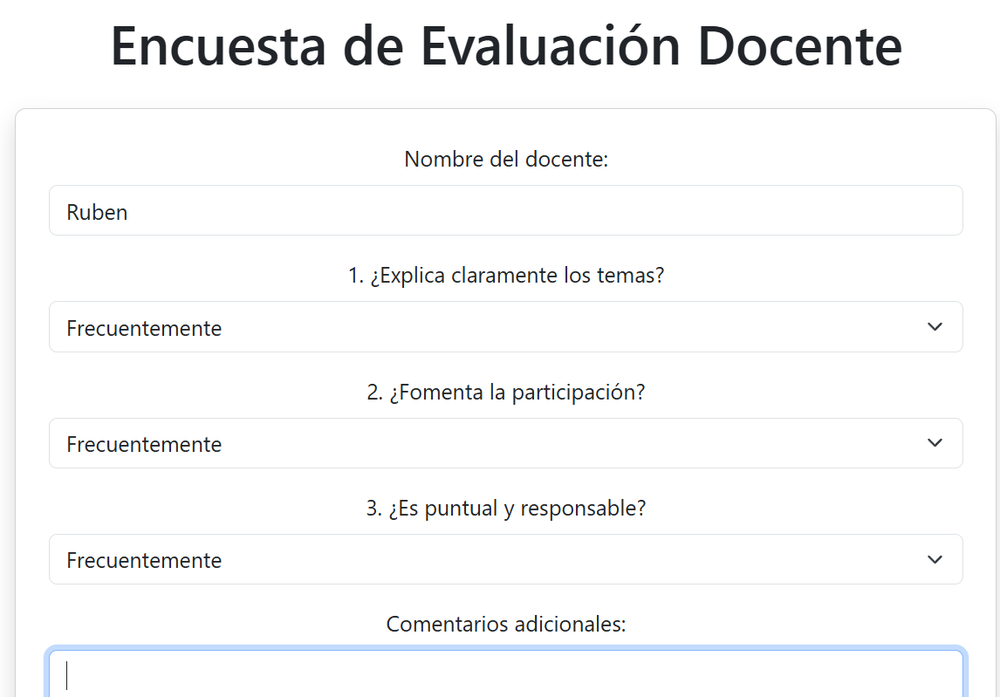

Este proyecto es una aplicación web desarrollada principalmente en PHP para demostrar cómo conectar, manejar y operar bases de datos MariaDB desde PHP. Se trata de una plataforma para gestionar evaluaciones a docentes

Preparación:
Instalas PHP, MariaDB y preparas la base de datos con bd.sql.

Configuración:
Creas un archivo .env para que tu app sepa cómo conectarse a la base de datos.

Ejecución:
Inicias el servidor de desarrollo con el comando proporcionado y accedes al sistema desde tu navegador en http://localhost:8080.

## Configuración

Crear la base de datos usando el archivo bd.sql.
Configurar un archivo .env con los parámetros de conexión a MariaDB.
Levantar el servidor local con el comando:
`cd EncuestaMariaDB`
luego

`php --server localhost:8080 --docroot public router.php`

