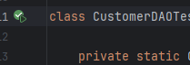
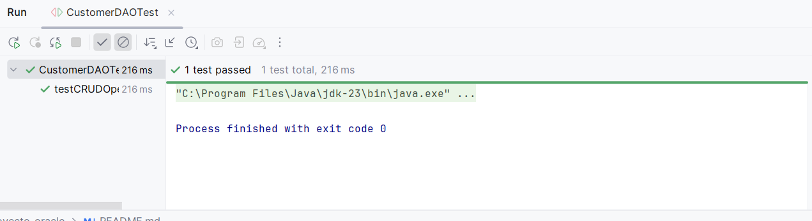

Para verificar que funciona se hace un test (CustomerDAOTest)

En la siguiente imagen se muestra la ejecución del test llamado testCRUDOp dentro de la clase CustomerDAOTest. El resultado indica que el test pasó correctamente (1 test passed), lo que significa que todas las operaciones principales (crear, leer, actualizar y eliminar) sobre la entidad Customer funcionan como se esperaba. Además, el proceso finalizó con código 0, lo que confirma que no se presentaron errores durante la ejecución de las pruebas unitarias.

Esto garantiza que la implementación del DAO (Data Access Object) cumple con los requisitos básicos y puede interactuar correctamente con la base de datos.

